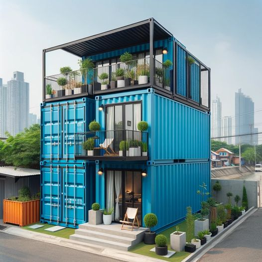

<h2>llama-3.2-vision</h2>

<i>Llama-3.2-Vision-11B is a really good model that probably gets the visual details right but doesn't understand literary or media references, and often fails to accurately represent the physical arrangement of objects and the implied relationships between the objects.</i>

The meme is a humorous image of a shipping container home, with a front door and a small porch. The text &quot;I don&#x27;t need a house, I need a house that&#x27;s a house&quot; is written on the front door. The image is a playful take on the idea of living in a tiny home, with a clever and humorous twist on the phrase &quot;I don&#x27;t need a house, I need a house that&#x27;s a house&quot;.

<h2>first-seen</h2>

<i>Because Git doesn't preserve file modification times, this metadata file contains the file's modification time when it was added to the library.</i>

2023-11-21T03:19:09+00:00

<h2>tesseract</h2>

<i>Tesseract is often terrible and just gives a lot of nonsense characters, but it used to be the state of the art, and usually it is better at correctly representing text than llama-3.2-vision-11b.</i>

&lt;&lt;) al ‘o

