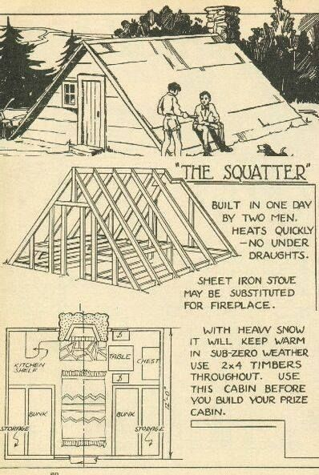

<h2>llama-3.2-vision</h2>

This meme is a humorous image of a person building a small cabin using a single sheet of paper, titled &quot;The Squatter&quot;. The text reads: &quot;Built in one day by two men. Heats quickly. No under-draughts. Sheet iron stove may be substituted for fireplace. With heavy snow it will keep warm in sub-zero weather. Use 2 x 4 timbers throughout. Use this cabin before you build your prize cabin.&quot; The image is likely meant to be humorous and satirical, poking fun at the idea of building a simple, simple cabin.

<h2>first-seen</h2>

2023-12-06T17:51:43+00:00

<h2>tesseract</h2>

es pO 2k Zi YS She JR yay &gt; . m f- ts Lae (i sh — hi A So LARA “TH Be AOR THIN ewes?” 4 [| KI) \ BY TwO MEN. Leena BONN IN ERG oer | AateE Ae ee Ae cewerrs. SESE SHEET IRON STOVE Re ce. TT sagen le ela ot! Polos ee jes) ae== rg el ty ares

