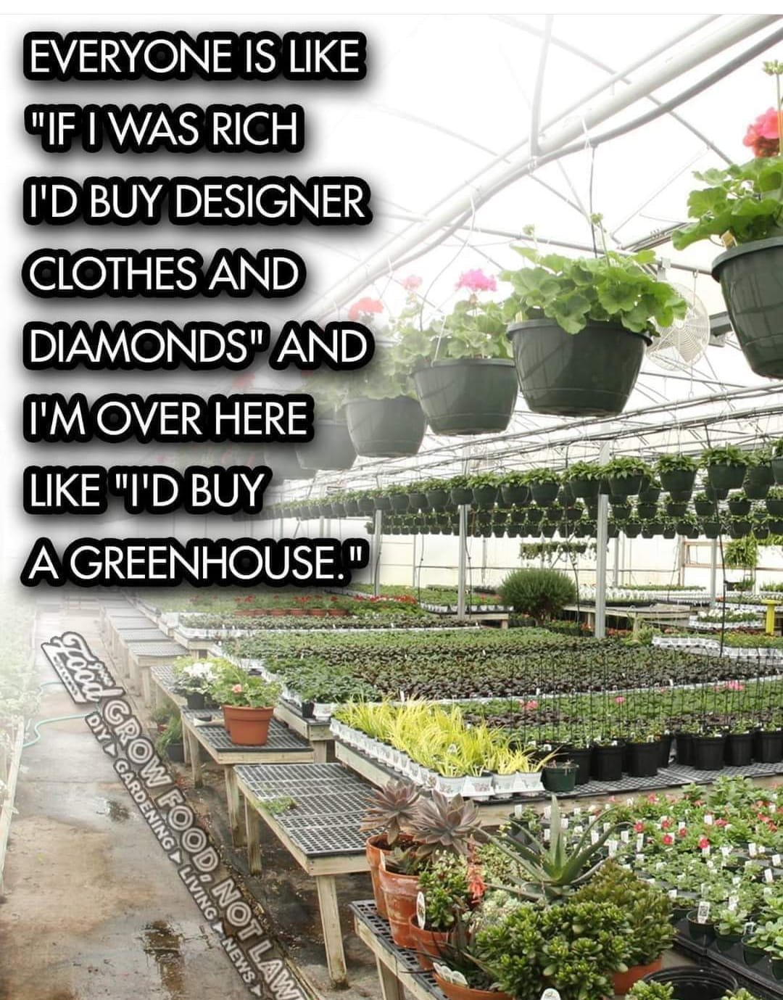

<h2>llama-3.2-vision</h2>

<i>Llama-3.2-Vision-11B is a really good model that probably gets the visual details right but doesn't understand literary or media references, and often fails to accurately represent the physical arrangement of objects and the implied relationships between the objects.</i>

This meme is a humorous commentary on the difference between the rich and the poor. The text on the left reads: &quot;Everyone is like &#x27;If I was rich, I&#x27;d buy...&#x27; and then gives a humorous, extravagant wish, such as &#x27;I&#x27;d buy designer clothes and diamonds.&#x27; However, the meme then subverts this expectation by saying &#x27;I&#x27;m over here like I&#x27;d buy a greenhouse.&#x27;&quot; This is a tongue-in-cheek way of saying that someone who is not wealthy might not have the luxury to buy expensive things, but can still have a simple, practical, and affordable option like a greenhouse.

<h2>first-seen</h2>

<i>Because Git doesn't preserve file modification times, this metadata file contains the file's modification time when it was added to the library.</i>

2023-12-18T20:56:19+00:00

<h2>tesseract</h2>

<i>Tesseract is often terrible and just gives a lot of nonsense characters, but it used to be the state of the art, and usually it is better at correctly representing text than llama-3.2-vision-11b.</i>

EVERYONE IS LIKE os &quot;IF.| WAS RICH »- I&#x27;D BUY DESIGNER! ee  \ ory  CLOTHES ’AND a a, o  ; -  DNNXO)NIBSNN IB) Po I&#x27;M OVER HERE © 55 easel -. vd - a ae a Wwe ae wer ec te Si a 2 i UKE DO _—eaneane EE BES CUR we (NE Nas | p@lUN sue) in mae tof a tl SD Ek a re eRe VR Le hee Paine 0 Ree ee XR SSS Se oS Coe ae Bere 8 le Nar gee oe Oe chk a . me. ca Bi sega al CX ; “SSC eiy eo ge  a ro eS ey CNG y aa ee, € a Ba. A?) LY

