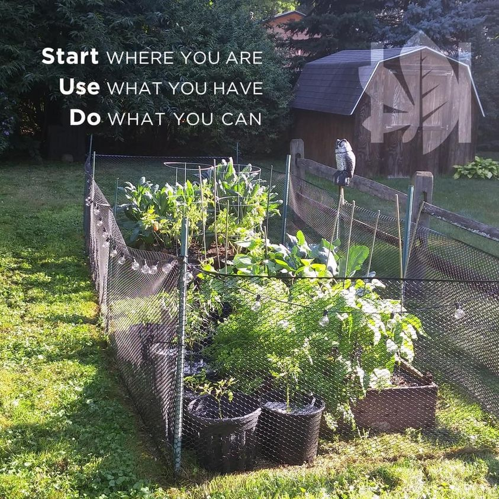

<h2>llama-3.2-vision</h2>

This meme features a humorous image of a garden with a chicken coop in the background. The text &quot;Start where you are, use what you have, do what you can&quot; is written in a playful, modern font, with the words &quot;Start&quot;, &quot;Use&quot;, and &quot;Do&quot; in bold. The image is meant to be a humorous and relatable take on the classic phrase &quot;start where you are, use what you have, do what you can&quot;, with the addition of a garden and a chicken coop in the background, implying that one can start a garden or a chicken farm with what they have.

<h2>first-seen</h2>

2024-01-08T21:17:33+00:00

<h2>tesseract</h2>

Pe eae &lt; Per RC Se 2 er a Start WHERE YOU ARE ee UF AV) Gy Cole Ey WY) =2 ee Se oR Win Wen Zol0) (or \\)  we | ‘el E mi er ee a 5 Bel Fe eRe ES, eae STE eee» aaa  Be cc ps ie in 4 uh | TN ee ly |e  A fe Ng oF ai SR | py = We 5 5 oa. | -S Rae Oe ee AS Bras cas A a rt S| alr 2 EF) Vg Re i ee sas on a F ) ae) 7, ee ee Ce Seer) = ane SN a 77/0 Mn NM eee ee eat enc ree wig Ye ei ee ee Yipes. Pues Gene Wie se “Vos eS. ee ee ye te A SS = ae Hit Recah ceoagiioae j a FO esi nae pe ea oeneaey pc ye ce ah er eee ae ea Vee en: SE: Be Re Bia 2) Me tee as Meh | SONI SS ek ea

