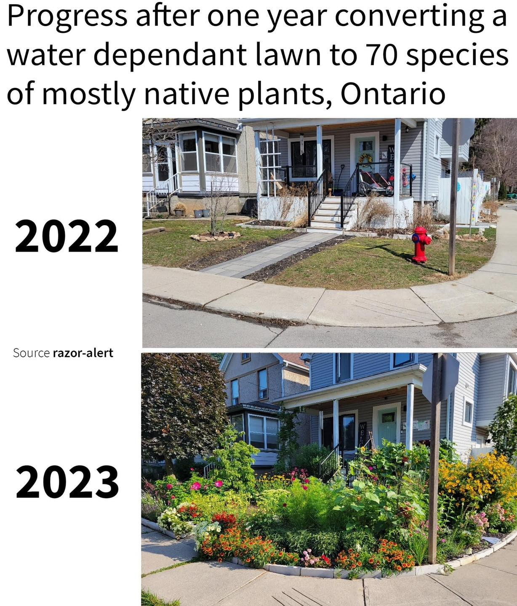

<h2>llama-3.2-vision</h2>

The meme is a humorous comparison of two images of a front yard. The first image, dated 2022, shows a typical suburban lawn with a few trees and some bushes. The second image, dated 2023, shows the same yard transformed into a lush, overgrown garden with a variety of plants and flowers. The text above the images reads, &quot;Progress after one year converting a water-dependent lawn to 70 species of mostly native plants, Ontario.&quot;

<h2>first-seen</h2>

2024-01-04T17:26:37+00:00

<h2>tesseract</h2>

Progress after one year converting a water dependant lawn to 70 species of mostly native plants, Ontario ate An) Be i FA iy | Ss chy ai | y [24a are tee \ id fi RG A Din ; Ch m=. de Fas Shee &#123;jo eee 2022 2s EE a oe es . oe he — Source razor-alert perrengunees » = | ae : Ae Me - &amp; | et eee (a id a oa date te | Are wy SAO a Ae eg a AS aes oe _ : ee =

