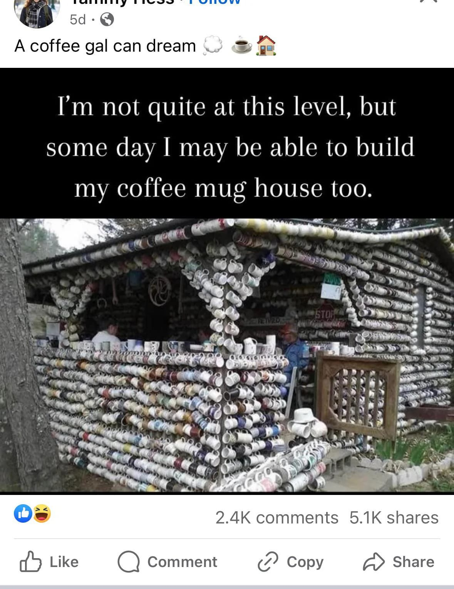

<h2>llama-3.2-vision</h2>

<i>Llama-3.2-Vision-11B is a really good model that probably gets the visual details right but doesn't understand literary or media references, and often fails to accurately represent the physical arrangement of objects and the implied relationships between the objects.</i>

This meme is a humorous take on the phrase &quot;I&#x27;m not quite at this level, but...&quot; It features a photo of a house made entirely of coffee cups, with the caption &quot;I&#x27;m not quite at this level, but some day I may be able to build my coffee mug house too.&quot; The image is a humorous commentary on the idea that someone&#x27;s ambition to build a house made of coffee cups is not yet a reality.

<h2>first-seen</h2>

<i>Because Git doesn't preserve file modification times, this metadata file contains the file's modification time when it was added to the library.</i>

2024-01-15T23:51:14+00:00

<h2>tesseract</h2>

<i>Tesseract is often terrible and just gives a lot of nonsense characters, but it used to be the state of the art, and usually it is better at correctly representing text than llama-3.2-vision-11b.</i>

G =x-2 A coffee gal can dream — = I&#x27;m not quite at this level, but some day I may be able to build my coffee mug house too. . x . ra a be J i i id , BS — Lm Ce é tin es 4 a, “ey ny % An a Te 3 mS oy lg in he : a nee re eu Eo ae ep ilac nS TD ce Dm a ce ete ten, ee rer’ AMY Me &lt;a Dag a hgeoan, PM nma PPu ay Oy NG I ese i Le Mist Bone int eke. aa a SS carsot nant pe. s 2.4K comments 5.1K shares d&gt; Like Q Comment (2 Copy a&gt; Share

