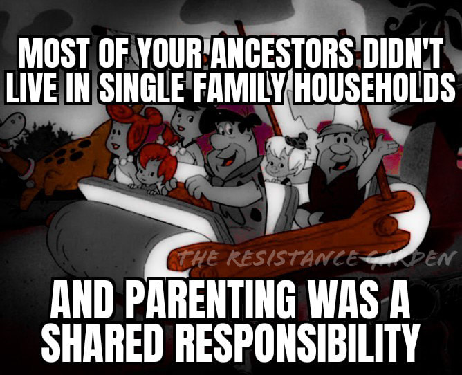

<h2>llama-3.2-vision</h2>

The meme is a humorous take on the idea that our ancestors didn&#x27;t live in single family households. The image is likely a cartoon or illustration of the Flintstones, a classic animated sitcom. The text at the top reads, &quot;Most of your ancestors didn&#x27;t live in single family households&quot; and the text at the bottom says, &quot;And parenting was shared responsibility, a family&quot;. The image is likely a humorous take on the idea that our ancestors didn&#x27;t live in single family households and that parenting was a shared responsibility.

<h2>first-seen</h2>

2024-01-18T23:25:49+00:00

<h2>tesseract</h2>

|  ftps AES. ha eT ea SU USA

