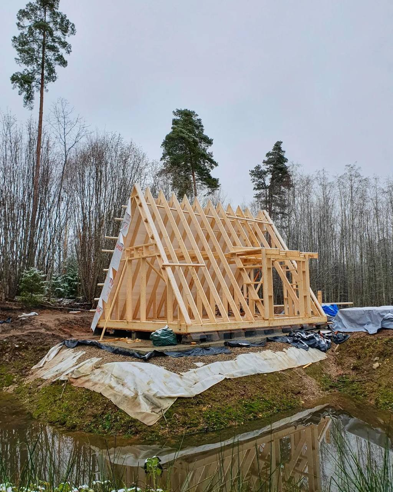

<h2>llama-3.2-vision</h2>

The meme is a photo of a small, unfinished wooden house, often referred to as a &quot;tiny house&quot; or &quot;micro cabin.&quot; The image is captioned &quot;When you finally get to build your own tiny house, but you still can&#x27;t get away from your parents&#x27; basement.&quot;

<h2>first-seen</h2>

2024-01-31T05:01:18.235585+00:00

<h2>tesseract</h2>

tk &gt; me ene pine Fees erp aE # I . Vy i , tie | =e an oe 1 ON A Pea) Baa: , ee ? ‘ Cee Sali = i | a ee . - AMM RAN NEU SH) 0 Uae a a on H ay ee Oa 24 Bh i MF A HI a. Oey A a ee i ti? AW&#125; Bh ii Hy Mya kuy Eh, iy ts Aer || oi Nee Ne iH hi f Hh he i i i ne | 9\ Beach A We SG ee HE AO AS eee | tee 2 a ry TP Naor (ss Caner Tae, Gee ee RS | 2 perce) | ) i) \\\\\\\ aie h ia a cw a = a ae sor ee eg ee en a | ae | a ee eee, CS ie Ce ths ie &amp; se 7 oN cus me ; oie! p LA &gt; . We preter ec ge Wi i Hey Fe Lath Te n ee a ey OLN Ar ay fi ii le pe Te 4 gi ELA Ni ; i i WN R\ ee HON ATE aio a Aaa. NH Uae Re I? een, NE ges AVN WN AD iogtegs) Sd. | Mie pie ae ia ANN NN 0 NAEP VEL TSAS RC. . MERLIN DNA Vaeoetnn ete ie [Nah Mi ] 1 TERNAL Ni)

