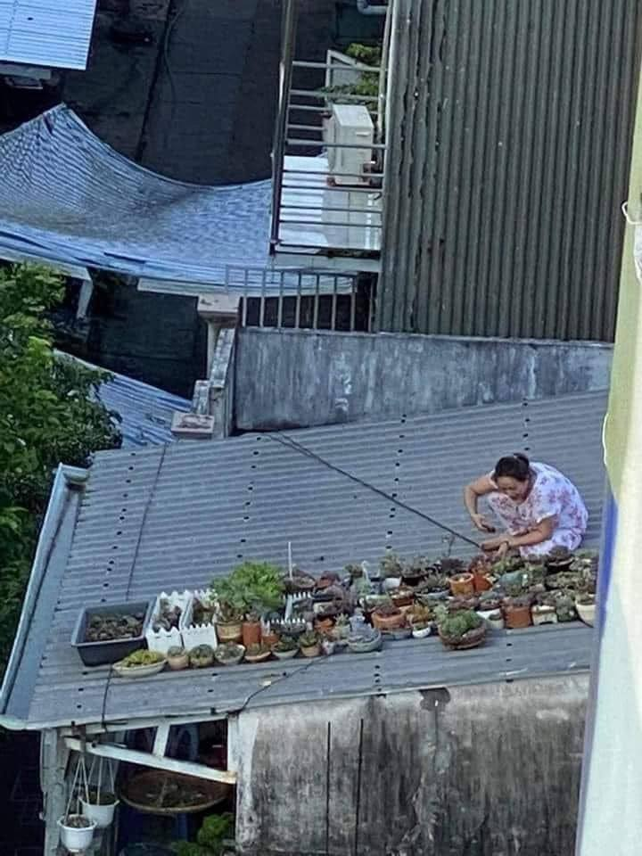

<h2>llama-3.2-vision</h2>

<i>Llama-3.2-Vision-11B is a really good model that probably gets the visual details right but doesn't understand literary or media references, and often fails to accurately represent the physical arrangement of objects and the implied relationships between the objects.</i>

The meme is a picture of a woman on a rooftop, surrounded by a large collection of potted plants. The text &quot;I can hear you but I don&#x27;t care&quot; is written above her, implying that she&#x27;s ignoring the people below her, who are likely complaining about the noise and mess of her plant collection. The humor comes from the contrast between her peaceful, self-sufficient lifestyle and the potential chaos she&#x27;s causing for her neighbors.

<h2>first-seen</h2>

<i>Because Git doesn't preserve file modification times, this metadata file contains the file's modification time when it was added to the library.</i>

2024-02-02T23:23:30.326249+00:00

<h2>tesseract</h2>

<i>Tesseract is often terrible and just gives a lot of nonsense characters, but it used to be the state of the art, and usually it is better at correctly representing text than llama-3.2-vision-11b.</i>

Mem TELL : | POLED OTE = | Let TTH LITT eee WAGE THEE BK SHUT ASS eT ELELLT Ss qi ae 4 ntl q SS —— if i&gt; ij t= nOnER I; ea bi ee IP - i } } Hit eo ne) dhe , ce | Re te ; # Srp WR ig hu: aaa, X ot Sea) = &gt; | eS eae : 2 B/S : —&amp; 2 : Ft = ae fas ee ee , ese ae SS ree s é —— ~ aie +f — _— hill bes adi be &gt; 5 peel 7 ES Ri rs ‘| ane iy id Y ! cee | Ae eh ye, Be are Zh .

