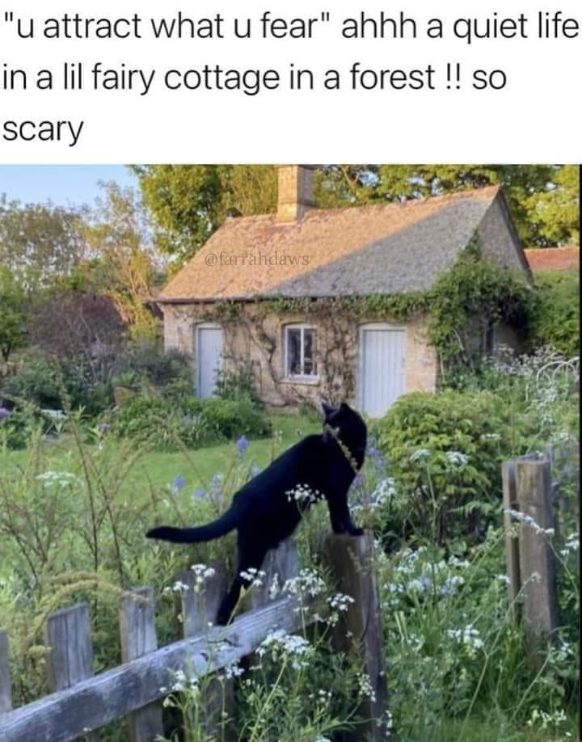

<h2>llama-3.2-vision</h2>

This meme is a humorous image of a black cat perched on a fence, looking out at a small, old-fashioned cottage in the woods. The text above the image reads, &quot;You attract what you fear, a quiet life in a little fairy cottage in the woods, so scary!&quot;

<h2>first-seen</h2>

2024-02-19T22:06:49.019685+00:00

<h2>tesseract</h2>

&quot;u attract what u fear&quot; ahhh a quiet life in alil fairy cottage in a forest !! so scary Tera ina eee ; Be ae eg Pasi. oF eee &#x27; ne yen, tk Sie Ne 7 NS ys ie 3 NOT pata since fede &lt;a ee ee &quot; iia s~o : Ly ‘ (rn i eggs ee Pe Md Be oer a pa t \ . a ”% Ke as ‘S co ORR 3 asa.

