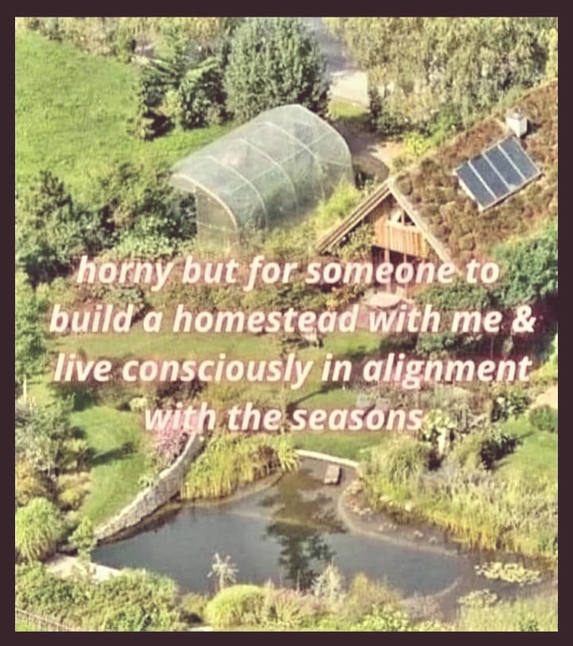

<h2>llama-3.2-vision</h2>

This meme is a humorous and slightly provocative image that pokes fun at the idea of building a homestead with someone. The text in the image reads: &quot;horny but for someone to build a homestead with me &amp; live consciously in alignment with the seasons.&quot; The image is likely a playful and cheeky take on the idea of building a home and living in harmony with nature.

<h2>first-seen</h2>

2024-03-17T23:28:56.182187+00:00

<h2>tesseract</h2>

ree iY gels Fh i APES SoS yy ha “Aiea Rn ie ChE) a ‘ee eee Be A as cd A &#125; y Lay) q ae SRN eee Ee Or e PW? = Pen Qrs-: Dial tee. php aK RPO &amp; meone to. er melliey kele re Cel toe eae gee oat dase Say eadtel ae Sh) a iD pe 5 get ott Rea ee te calle e- © ns am , “&#125; &#x27; ° (live cons all Me SI MLL LD Fa We ost ai eo 1 VATS hye cee eg eo Mf, a led ha _ Mie Lemtin ihe — Pon aie SA Ae Rg

