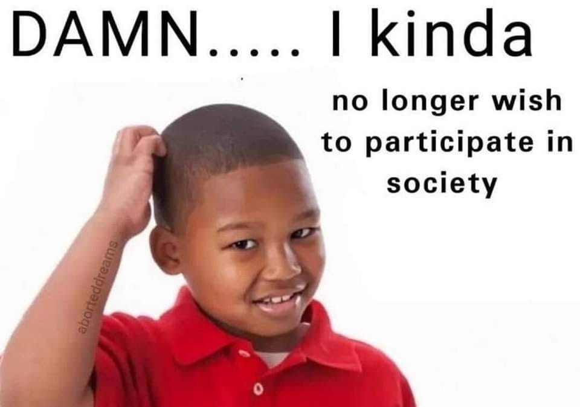

<h2>llama-3.2-vision</h2>

The meme is a humorous image of a young boy with his hand on his forehead, looking puzzled. The text above him reads &quot;DAMN... I kinda no longer wish to participate in society&quot;. The meme is likely used to express frustration or annoyance with the demands or expectations of society, and the boy&#x27;s facial expression is a comedic way to convey that feeling.

<h2>first-seen</h2>

2024-04-11T18:48:40.105955+00:00

<h2>tesseract</h2>

DAMN..... | kinda 7 no longer wish to participate in - society . ed | ne ° .

