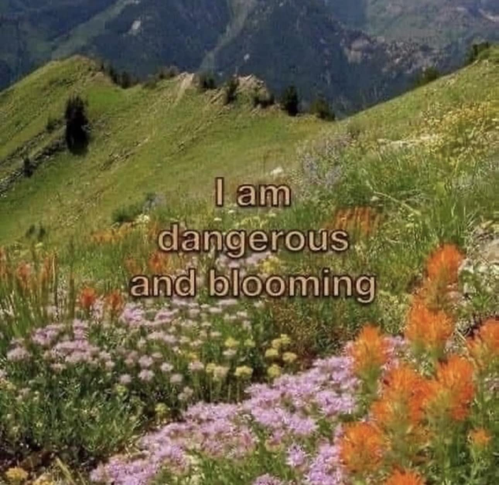

<h2>llama-3.2-vision</h2>

The meme is a humorous image of a wildflower field with a caption that reads &quot;I am dangerous and blooming&quot;. The image is likely a playful and ironic take on the idea of being both &quot;dangerous&quot; and &quot;blooming&quot; at the same time, suggesting that the speaker is both powerful and flourishing. The image is likely meant to be humorous and lighthearted, and is not meant to be taken seriously.

<h2>first-seen</h2>

2024-05-03T20:21:05.526622+00:00

<h2>tesseract</h2>

i | wa Phas 2 &quot;I oe  Fe ee , a : oe cn el ;  -. - s ee , r i ory _  os ek 7 Pet Fis tie  . ~ A - PPT TAS re =  SZ mol r eon ee  3 : “ nit oP hah Se Phy a \WaRab ) oe, verte,  ; : Ta eee la . 4 a ae _ ein =o oe eae : we :  As yan % da ae hg . y 4; : ae tT if y . -  %. ’ / Ure ras 4  ee ee St OKEIUC KEL OL US Fase ey ee BUM eae St OP ek &#x27;  x, . i eee ia a\eld ole ” oy) pa wi “i - Tih boi IA olKexela ni inte awe: ens + Pl sy * ie 4 og ae . et I ; A , PR as a ie  ty 1 he, ewe Bhd TF p 4: % 2 teh in SCS Ge ae SB.) a pene? Ue teed * dead ie r re ae wee eet a we RS  % mT eae . . a hd es (ae SEs eS SD se. a= ~ a Ree Age. ee ae» tn ER a Vie pean ee -’han aie yas 7 7 we - LS . “ Fr. : : Fs e % ea te PR - NT

