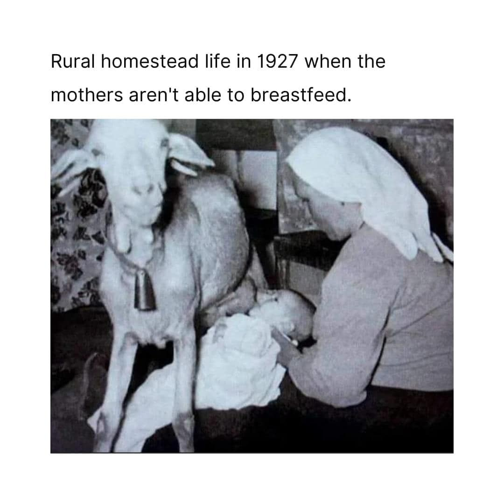

<h2>llama-3.2-vision</h2>

This meme is a humorous take on the idea that rural life in 1927 was very different from modern times. The image shows a woman in a rural setting, nursing a baby, while a goat is also nursing from her. The text above the image reads &quot;Rural homestead life in 1927 when the mothers aren&#x27;t able to breastfeed.&quot;

<h2>first-seen</h2>

2024-05-19T00:12:00.198060+00:00

<h2>tesseract</h2>

Rural homestead life in 1927 when the mothers aren&#x27;t able to breastfeed. pe J % : Py Ff 4 7 . “A ey 7 | ‘ T p i a = VN fa 5 t Ei

