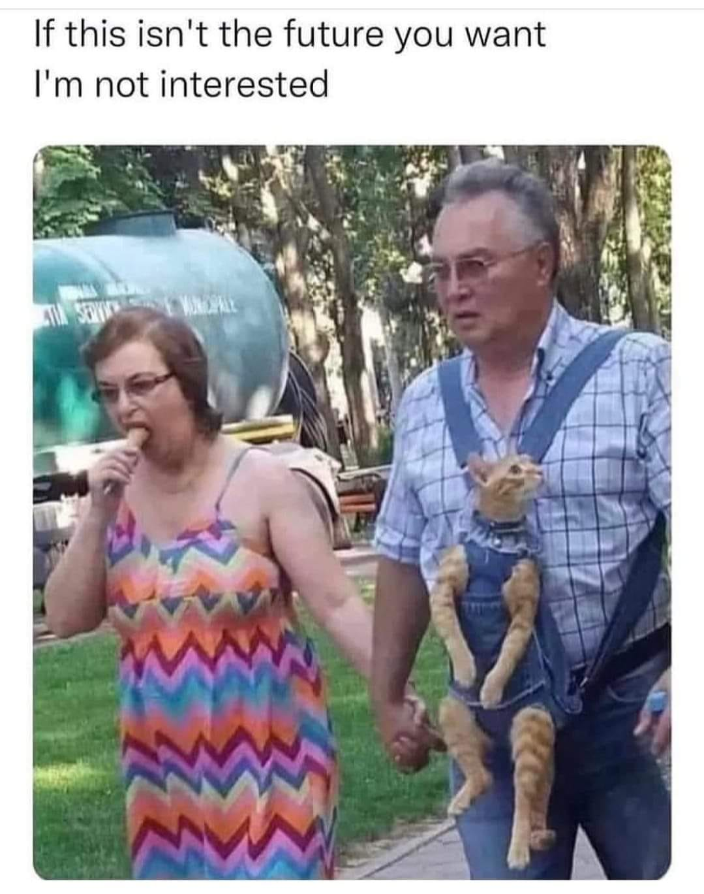

<h2>llama-3.2-vision</h2>

This meme is a humorous image of a couple walking together, with the woman eating a snack and the man carrying a cat in a strange, makeshift &quot;pouch&quot; made from his overalls. The image is captioned &quot;If this isn&#x27;t the future you want, I&#x27;m not interested.&quot; The joke is that the man is so committed to his relationship that he&#x27;s willing to carry a cat in his clothes, even if it&#x27;s not the most practical or comfortable solution.

<h2>first-seen</h2>

2024-05-31T20:51:55.527818+00:00

<h2>tesseract</h2>

If this isn&#x27;t the future you want I&#x27;m not interested SRG wy, fi taee oe anne fe od 3 a mes | 2 ms ‘ j &#125; My 4: es I sae aes At KN aL , 0.3 Rig Le . » ’ &gt; 7 » ‘ N ‘ BS VY hy pre eee i \ A . i: * i D tae / , , ‘ S ‘ y yf ri. a ~ # QW oA sa’ . . Ee es Poe (|| Tebe ae, Fo ee 4 -™ % ee P| le _ : \ f y, &lt;a | A | ZC

