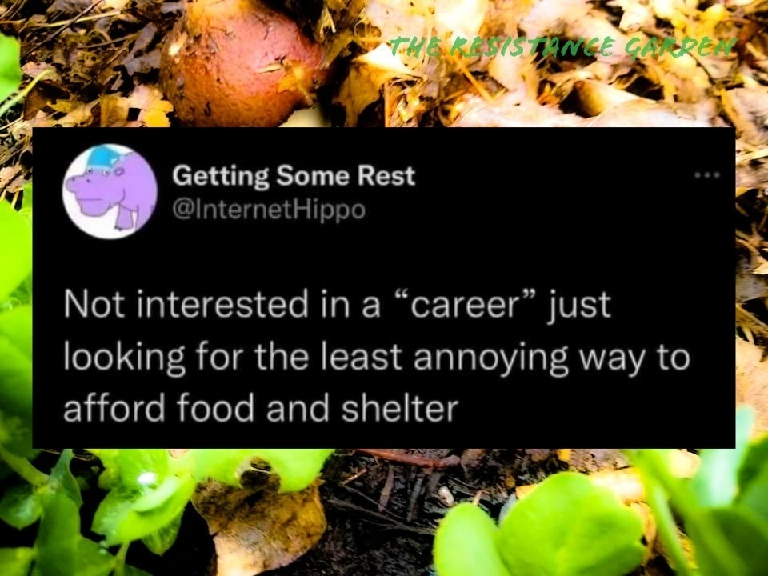

<h2>llama-3.2-vision</h2>

This meme is a humorous take on the idea that some people&#x27;s jobs or careers are not as exciting or fulfilling as they would like. The text &quot;Not interested in a &#x27;career&#x27; just looking for the least annoying way to pay the bills&quot; is a tongue-in-cheek expression of this sentiment. The image is likely a humorous or relatable image, but the text itself is the focus of the meme.

<h2>first-seen</h2>

2024-06-02T21:02:03.114878+00:00

<h2>tesseract</h2>

an es) . oe 4 ae Nee 4 4 ia’ | bw é 3 Fae i ae SS ee aw y LA a A Getting Some Rest oe = ia @InternetHippo ; | ~~ : Not interested in a “career” just &lt; looking for the least annoying way to afford food and shelter So = Sei ; wai . =f Se ma th

