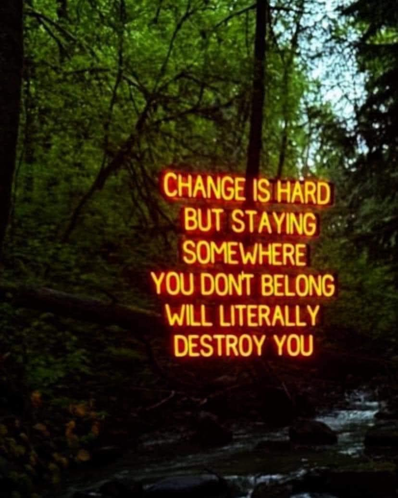

<h2>llama-3.2-vision</h2>

The meme is a humorous and darkly ironic image with the text: &quot;Change is hard. But, staying somewhere you don&#x27;t belong will literally destroy you.&quot; The image is likely a dark or eerie landscape, such as a forest or abandoned building, with the text appearing in a bold, neon-like font. The overall tone is meant to be humorous and satirical, poking fun at the idea that people often struggle with change, but also that staying in a situation that&#x27;s not right for you can be disastrous.

<h2>first-seen</h2>

2024-06-19T02:30:07.162464+00:00

<h2>tesseract</h2>

Re NSA 3 o &#125; bot ee te x ‘+. ou gee £3) e ae &gt; &lt; Re nace fe ae ri Se v. a eee eS ~~ x -* ee St a ts A any y e PPO RE an ee aa leet as ; mf - e een aN 3 oy) ee h-- ™ i) wa . ae eae ma Rohe: tiple ar - oT meat a

