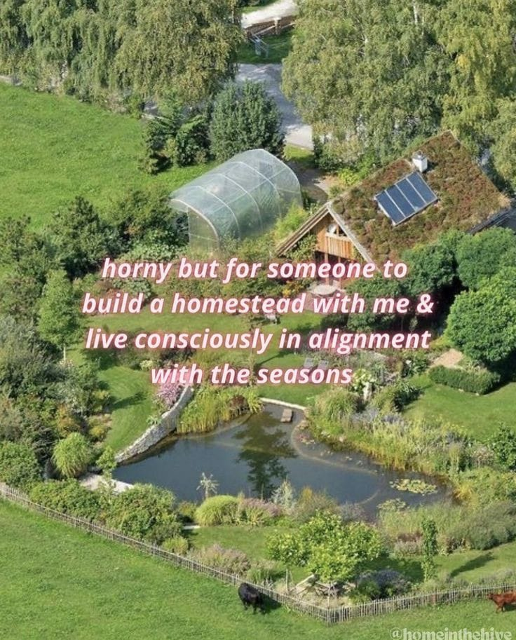

<h2>llama-3.2-vision</h2>

<i>Llama-3.2-Vision-11B is a really good model that probably gets the visual details right but doesn't understand literary or media references, and often fails to accurately represent the physical arrangement of objects and the implied relationships between the objects.</i>

This meme is a humorous take on the idea of a romantic relationship. The text reads &quot;horny but for someone to build a homestead with me &amp; live consciously in alignment with the seasons&quot; and is presented in a playful, handwritten font. The image is not actually needed to understand the joke, as the text is the main point of the meme.

<h2>first-seen</h2>

<i>Because Git doesn't preserve file modification times, this metadata file contains the file's modification time when it was added to the library.</i>

2024-08-08T02:26:23.144252+00:00

