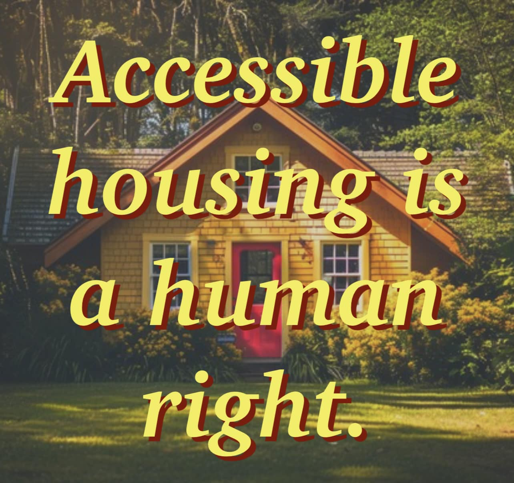

<h2>llama-3.2-vision</h2>

The meme is a humorous commentary on the concept of &quot;accessible housing.&quot; It features an image of a small, cozy house in a forest, with the phrase &quot;Accessible housing is a human right&quot; superimposed over it in bold, yellow letters. The text is meant to be ironic, implying that the idea of accessible housing is not only a basic human right, but also a simple and obvious one.

<h2>first-seen</h2>

2024-09-05T04:05:39.905960+00:00

