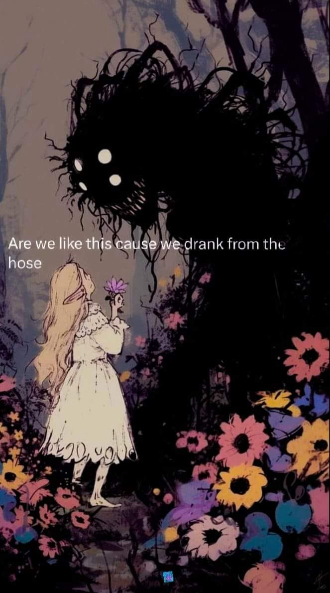

<h2>llama-3.2-vision</h2>

The meme is a humorous image of a young girl from the classic children&#x27;s book &quot;Alice&#x27;s Adventures in Wonderland&quot; standing in a forest, facing a large, dark, and ominous-looking creature with glowing eyes. The creature is actually the &quot;Jabberwocky&quot; from the book, a monster that has been brought to life by the girl&#x27;s imagination. The text above the girl reads &quot;Are we like this because we drank from the hose?&quot;

<h2>first-seen</h2>

2024-09-05T02:15:51.033831+00:00

