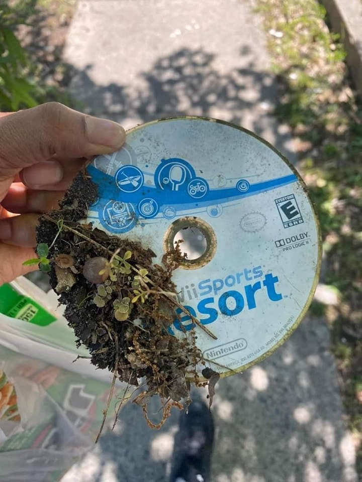

<h2>llama-3.2-vision</h2>

This meme is a photo of a person holding up a dirty, old, and broken Wii Sports Resort game disc, with a small amount of dirt and plants growing out of it. The text on the disc reads &quot;Wii Sports Resort&quot; and has a few scratches and marks on it. The meme is likely poking fun at the idea that even the most high-tech and advanced technology can eventually fall apart and become a part of the natural world.

<h2>first-seen</h2>

2024-10-19T20:34:59.443128+00:00

