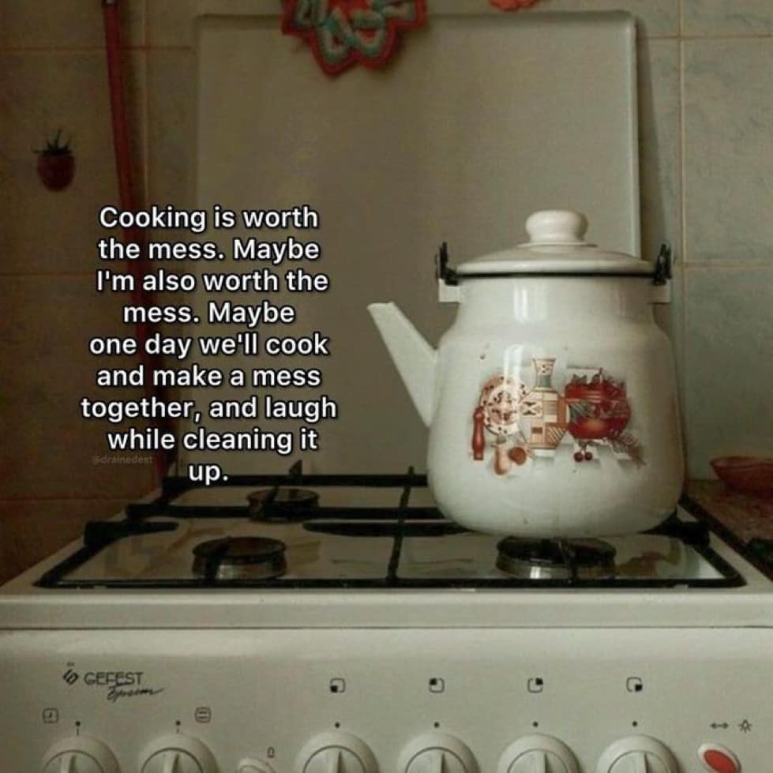

<h2>llama-3.2-vision</h2>

<i>Llama-3.2-Vision-11B is a really good model that probably gets the visual details right but doesn't understand literary or media references, and often fails to accurately represent the physical arrangement of objects and the implied relationships between the objects.</i>

This meme is a humorous take on the idea that cooking is a messy and chaotic process. The image shows a messy kitchen with a pot on the stovetop and a quote overlayed on top of it. The quote reads: &quot;Cooking is like a relationship, it&#x27;s messy, it&#x27;s complicated, and it&#x27;s always a little bit of a disaster, but in the end, it&#x27;s worth it.&quot;

<h2>first-seen</h2>

<i>Because Git doesn't preserve file modification times, this metadata file contains the file's modification time when it was added to the library.</i>

2024-10-24T22:24:05.229248+00:00

