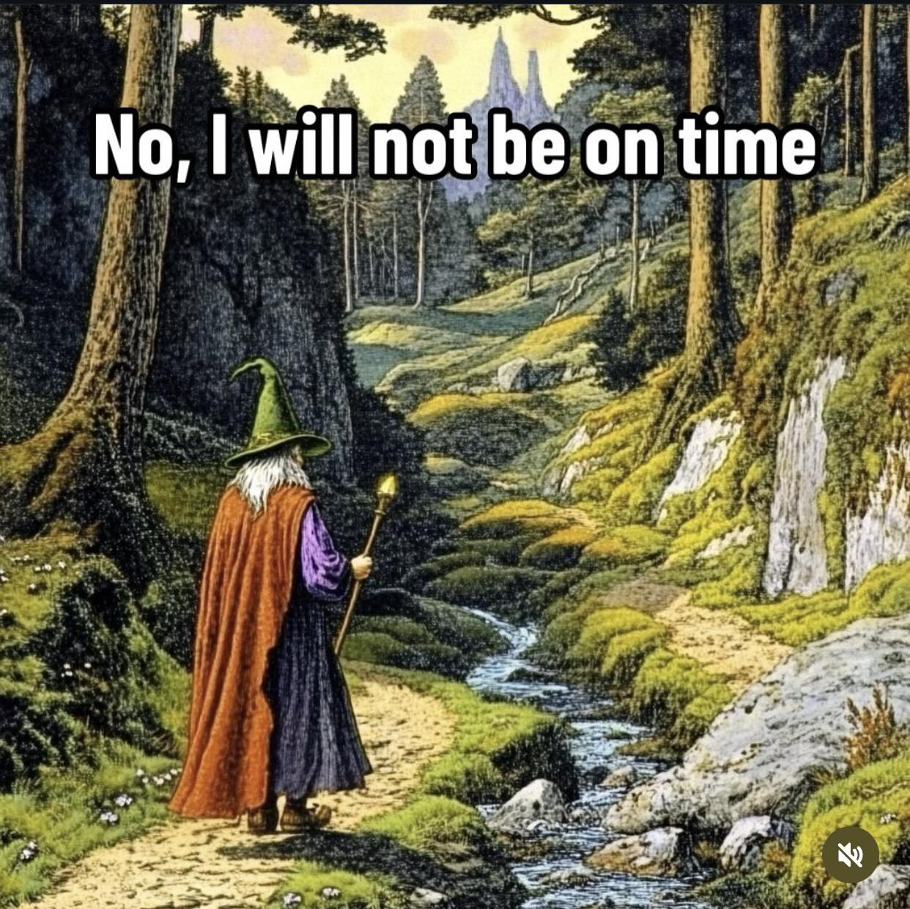

<h2>llama-3.2-vision</h2>

This meme features a wizard in a forest, looking at a clock that says &quot;hast&quot; (an old-fashioned word for &quot;has&quot;) and &quot;not&quot; (a negative word). The text above the image reads &quot;No, I will not be late&quot; and the text below it says &quot;No, I will not be on time&quot;. The image is humorous because it shows a wizard who is both late and on time, which is a contradictory and absurd situation.

<h2>first-seen</h2>

2024-10-24T03:56:37.105061+00:00

