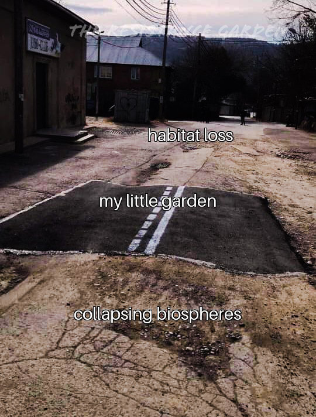

<h2>llama-3.2-vision</h2>

This meme is a humorous take on the concept of a &quot;little garden&quot; in a desolate or abandoned environment. The image shows a cracked and worn-out road with a &quot;little garden&quot; marked in the middle, with the text &quot;my little garden&quot; written above it. The text below it reads &quot;collapsing biospheres&quot; and &quot;habitat loss&quot;, implying that even the most optimistic and small-scale efforts (like a &quot;little garden&quot;) are not enough to save the environment from the effects of &quot;collapsing biospheres&quot; and &quot;habitat loss&quot;.

<h2>first-seen</h2>

2024-10-28T04:51:18.377380+00:00

