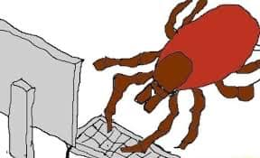

<h2>llama-3.2-vision</h2>

<i>Llama-3.2-Vision-11B is a really good model that probably gets the visual details right but doesn't understand literary or media references, and often fails to accurately represent the physical arrangement of objects and the implied relationships between the objects.</i>

This meme is an image of a spider crawling out of a computer screen. The text &quot;Ctrl+Alt+Del&quot; is written on the screen, but the spider is actually crawling out of the &quot;D&quot; key.

<h2>first-seen</h2>

<i>Because Git doesn't preserve file modification times, this metadata file contains the file's modification time when it was added to the library.</i>

2024-10-29T00:01:05.447818+00:00

