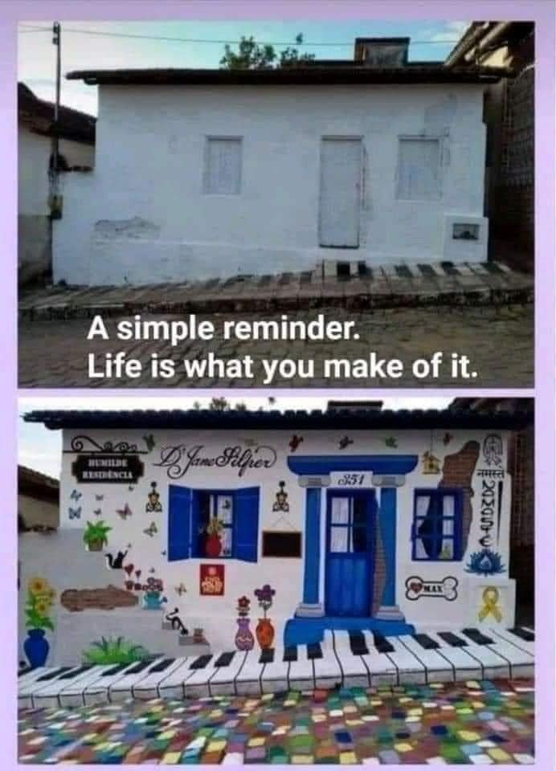

<h2>llama-3.2-vision</h2>

This meme is a humorous comparison between two images of a small, white house. The top image is a plain, unadorned house, while the bottom image is a house transformed into a vibrant, musical-themed wonderland, with a piano-shaped entrance, a &quot;D&quot;J&quot; sign, and a &quot;R&quot;eady&quot; sign. The text &quot;A simple reminder. Life is what you make of it.&quot; is written below the bottom image, implying that the second house is a creative, optimistic response to the first one.

<h2>first-seen</h2>

2024-11-07T21:08:19.891961+00:00

