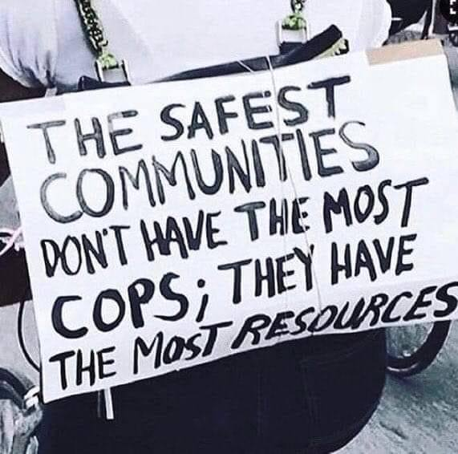

<h2>llama-3.2-vision</h2>

The meme is a humorous image that pokes fun at the idea that the police are the most trusted and important part of a community. The text on the sign reads: &quot;The safest communities don&#x27;t have the most cops, they have the most resources.&quot; The image is likely a satirical commentary on the common misconception that more police officers are needed to keep a community safe, when in reality, investing in resources such as education, healthcare, and economic development can actually create a safer and more stable community.

<h2>first-seen</h2>

2024-11-14T17:21:57.073903+00:00

