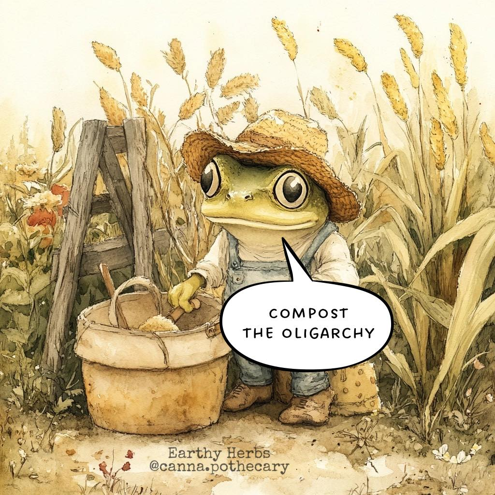

<h2>llama-3.2-vision</h2>

The meme features a cartoon frog wearing a hat and holding a basket, with a speech bubble saying &quot;Compost the Oligarchy&quot;. The image is a humorous take on the idea of revolutionizing the way we think about food and the power structures that control it. The frog is using a tool to turn over the soil, symbolizing the need to transform the way we approach food and the power structures that control it.

<h2>first-seen</h2>

2025-02-19T18:55:53.523932+00:00

