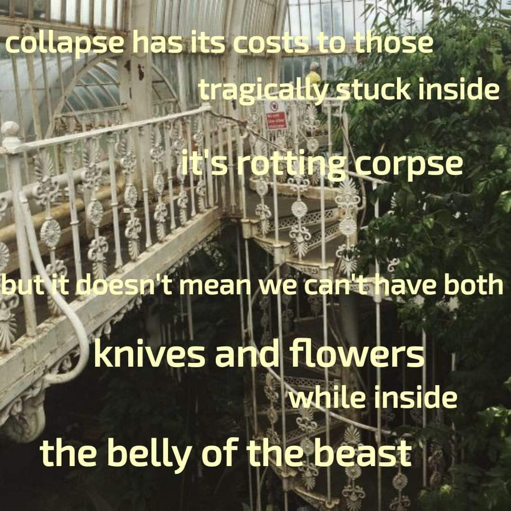

<h2>llama-3.2-vision</h2>

The meme is a humorous and darkly satirical image featuring a dilapidated and eerie-looking Victorian-style greenhouse with a broken and twisted iron staircase. The text overlaid on the image reads: &quot;collapse has its costs to those / tragically stuck inside / it&#x27;s a rotting corpse / but it doesn&#x27;t mean we can&#x27;t have both / knives and flowers / while inside / the belly of the beast.&quot; The image is meant to be a darkly humorous and ironic commentary on the human experience of pain and suffering.

<h2>first-seen</h2>

2025-05-21T23:48:45.398002+00:00

