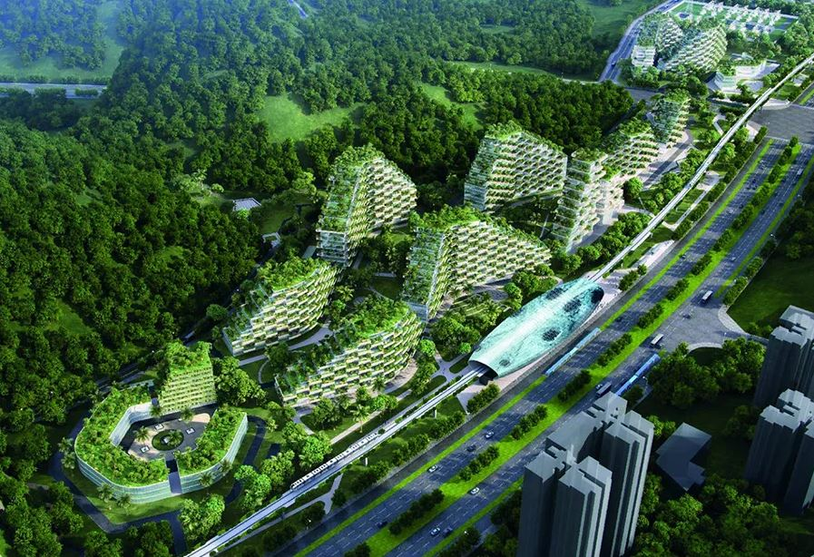

<h2>llama-3.2-vision</h2>

This meme is a visual representation of a city&#x27;s infrastructure being completely overgrown by nature. The image shows a city&#x27;s roads, buildings, and infrastructure being covered in lush greenery, with trees and vines crawling over everything. The text &quot;I&#x27;m not saying we&#x27;re not doing anything, I&#x27;m just saying we&#x27;re doing it differently&quot; appears in the image, implying that the city is being taken over by nature in a way that is not being actively controlled.

<h2>first-seen</h2>

2023-08-15T00:58:19+00:00

<h2>tesseract</h2>

OO NR SRS as S RL Re EOE E eR cus TS Skee hele BE MSE Ghee eee ct ot er ER AS ra me ee ee ae SS i Ste ey E¥icicouet se gt ws salen eee alee &lt;e ee oy Gna es eee GN Ri ee. ’ Fe ie Aigrniay Sere pers ce Sa eee ‘4 ee re RS ; spn ea ome = SA ee . ‘ prathit. ae eee &lt;r Re | CaaS p pe NSS ea ale i ae see Vd a 8 PS Pe 2 02S no aia Oe Se A % F ety BP ess ve Sa = ee a ‘ 7 3 eee Sie Ba iG Je ee ore ae. Ra otf ze . &lt; was 3 Get oS yey fume jay ae cee SG 2 oo ee i : er ee RO nes 4 ot A ee eae. MEF IA LITO &gt; Se &lt;8 pe ae a , ea IG “&amp; a. ay Je = Ss EN ee ale fos :

