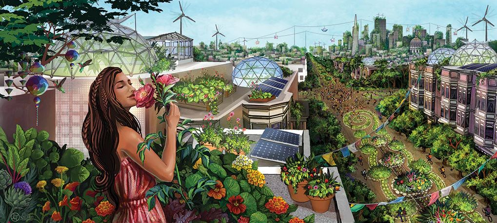

<h2>llama-3.2-vision</h2>

<i>Llama-3.2-Vision-11B is a really good model that probably gets the visual details right but doesn't understand literary or media references, and often fails to accurately represent the physical arrangement of objects and the implied relationships between the objects.</i>

This meme is a split-image comparison of two illustrations. The top image depicts a beautiful woman in a lush garden, surrounded by flowers and trees, with a gentle expression on her face. The text &quot;I&#x27;m not a gardener, I&#x27;m a gardener-er&quot; is written above her.  The bottom image shows a chaotic and disheveled garden, with weeds and trash scattered everywhere. The text &quot;I&#x27;m not a gardener, I&#x27;m a gard-ner&quot; is written above it.  The meme is a humorous comparison of two different approaches to gardening, with the top image representing a peaceful and organized approach, and the bottom image representing a chaotic and disorganized approach.

<h2>first-seen</h2>

<i>Because Git doesn't preserve file modification times, this metadata file contains the file's modification time when it was added to the library.</i>

2023-08-15T00:59:53+00:00

<h2>tesseract</h2>

<i>Tesseract is often terrible and just gives a lot of nonsense characters, but it used to be the state of the art, and usually it is better at correctly representing text than llama-3.2-vision-11b.</i>

a ee ea Wee nee A eel! AS i tien it eli ee SSN : a f ae eeu ie eg FPO Rc aS sles Adios x oil ae EN lg eee 5 ee Ree ee CC OO Lan? ar oR a 6 Neal il, WG . 4AM AS aos oe if lied il aN ll &gt; Gee 4 ee teal See oa al &gt; Ea VAM EA OS Pre a= (ey ae be. eam Re NES 3 SS ‘ yy; ‘ P SA io eer s 3 sO oe re” a iY BN 23 . Vas eo oa nA Eo (| ee See SS Z Ny \.) aes =

