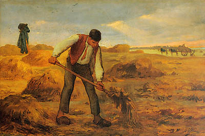

<h2>llama-3.2-vision</h2>

This meme is a humorous image of a man in a 19th-century-style painting, specifically &quot;The Angelus&quot; by Jean-François Millet. The image shows a man standing in a field, holding a pitchfork, with a look of intense frustration. The text &quot;I&#x27;m not lazy, I&#x27;m just on [insert time]!&quot; is written above the man&#x27;s head, implying that he&#x27;s not actually working, but rather taking a break.

<h2>first-seen</h2>

2023-05-10T20:59:58+00:00

<h2>tesseract</h2>

lL ae |  z g ‘= ero eey i eae Pe ee

