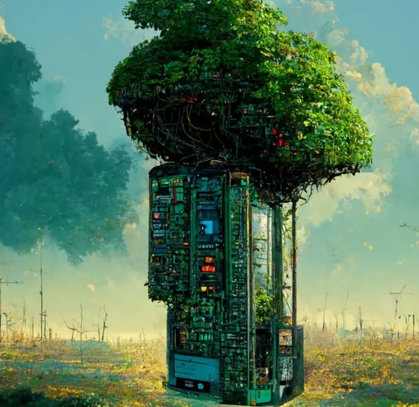

<h2>llama-3.2-vision</h2>

The meme is a humorous image of a tree made of a computer motherboard, with a green and leafy top. The image is captioned &quot;I told my wife I was going to reboot, she didn&#x27;t understand.&quot; The joke is a play on words, using the computer term &quot;reboot&quot; to mean both restarting a computer and also having a romantic relationship.

<h2>first-seen</h2>

2023-08-15T01:00:34+00:00

<h2>tesseract</h2>

if aS mi re &quot; iB Bat 7 Reece “3 en i e Pa as ee . ie Fos gach AR : aa F - See AS is &gt;» aaa pe . wy, The pe Soh. ee ee ee 7 eo es PAL ee Boe! ae) |) + ee ty BS) ; ese (| | Cee. . ees H ee cs | Sen YI eon) , fates | aie | ib i bi llh TT &#123;f eae &#123; a i suai in Sl lll Set ara eigen ee ; BMS alia eteebes ts ch 4 Sct be cane Oe te eee So a a

