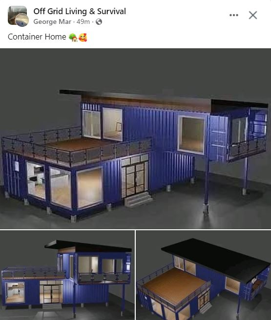

<h2>llama-3.2-vision</h2>

The meme is a screenshot of a Facebook post from a page called &quot;Off Grid Living &amp; Survival&quot;. The post is titled &quot;Container Home&quot; and features a 3D rendering of a house made from shipping containers, with a caption that reads &quot;Container Home&quot;.

<h2>first-seen</h2>

2023-09-03T21:31:48+00:00

<h2>tesseract</h2>

ee Off Grid Living &amp; Survival «a X Ig) George Mar: 49m-@ Container Home @ TT — i TM ia Mh jie [ aati = ol as MIT He TT ie - Lit, Fe | —_ PL. a af aul ~ LYS

