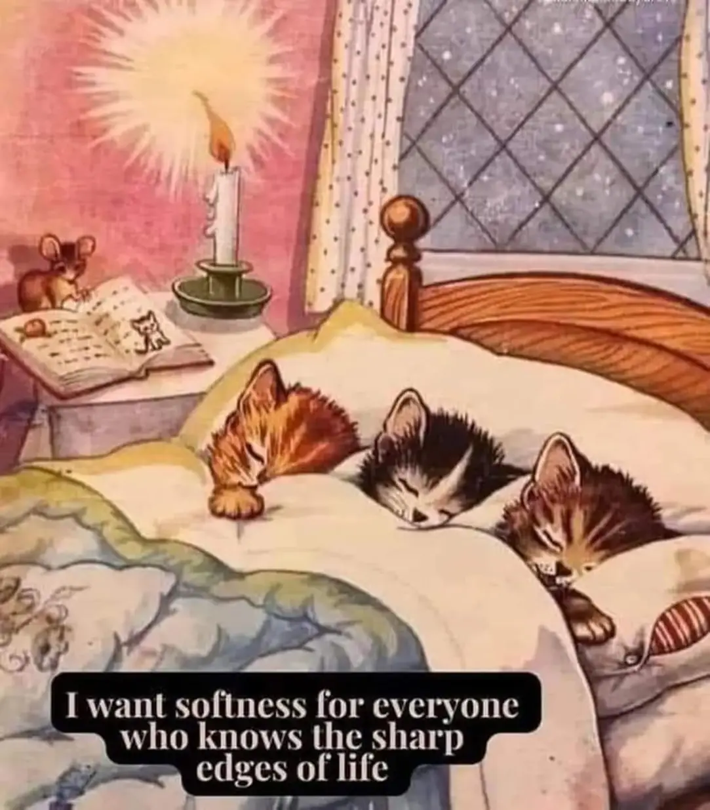

<h2>llama-3.2-vision</h2>

<i>Llama-3.2-Vision-11B is a really good model that probably gets the visual details right but doesn't understand literary or media references, and often fails to accurately represent the physical arrangement of objects and the implied relationships between the objects.</i>

The meme is a humorous illustration of a cat&#x27;s perspective on the idea of &quot;softness.&quot; It shows a cat&#x27;s room with multiple cats sleeping, and a quote at the bottom that reads: &quot;I want softness for everyone who knows the sharp edges of life.&quot; The image is meant to be a comforting and soothing visual, with the cats&#x27; peaceful sleep and the quote&#x27;s message of empathy and understanding.

<h2>first-seen</h2>

<i>Because Git doesn't preserve file modification times, this metadata file contains the file's modification time when it was added to the library.</i>

2023-05-10T20:59:59+00:00

<h2>tesseract</h2>

<i>Tesseract is often terrible and just gives a lot of nonsense characters, but it used to be the state of the art, and usually it is better at correctly representing text than llama-3.2-vision-11b.</i>

J Bary | 4 &gt; 1 et ee co 4 “| j ie . x, Ls ~ ! Ji . 4 es fi Ze a RS a ay ~ app = ; d | ’ con 7 2 WI J ”~ eX, » : ~~ ~ BR sO mavoeroice who knows the sharp Se MER BIG “&amp; \

