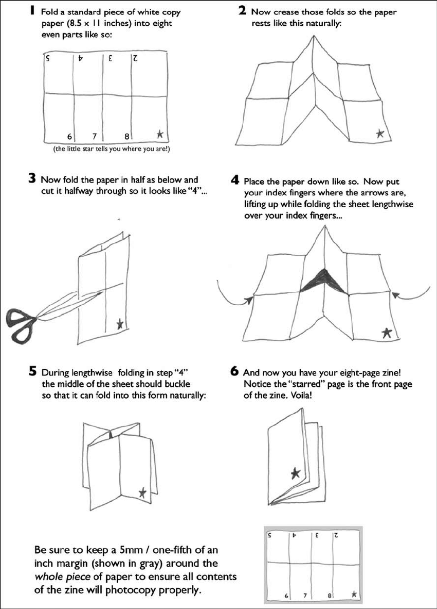

<h2>llama-3.2-vision</h2>

This meme is a step-by-step guide to creating a simple paper fortune teller, also known as a &quot;cootie&quot; or &quot;daisy&quot; in some regions. The instructions are presented in a humorous, tongue-in-cheek manner, using a series of sarcastic and playful comments to guide the reader through the process. The text at the bottom of the image reads: &quot;Be sure to keep a 5mm / one-fifth of an inch margin (shown in gray) around the whole piece of paper to ensure all contents of the zine will photo copy properly.&quot;

<h2>first-seen</h2>

2025-06-19T20:11:31.014001+00:00

